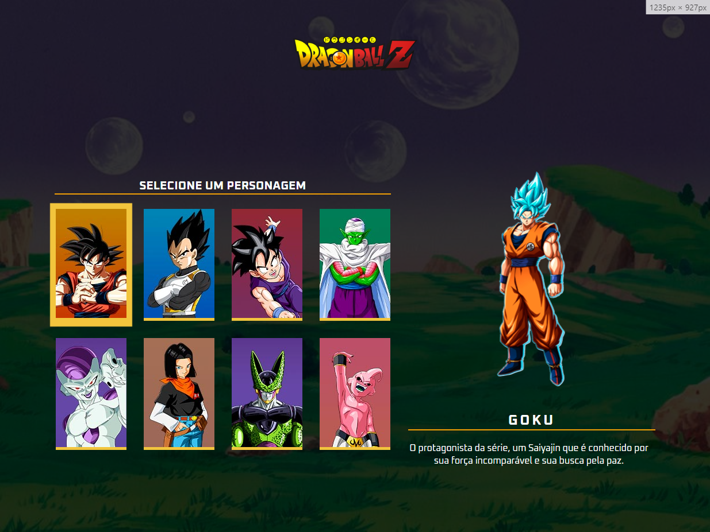
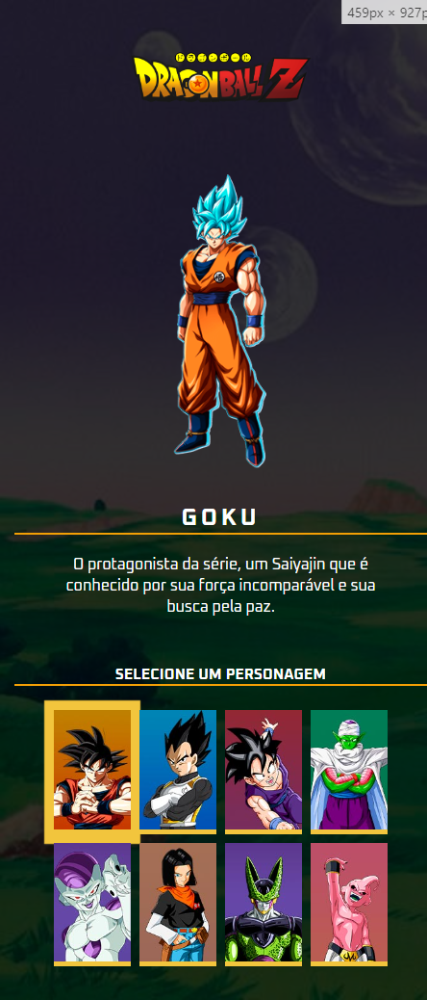

# Projeto Dragon Ball
  Projeto desenvolvido a partir da imersão Semana do Zero ao Programador contratado do Canal Dev em Dobro, o projeto original era sobre X-MEN, apenas substituir o tema para Dragon Ball, mas todo layout da pagina tem os credito dos gêmeos do canal dev em dobro. O projeto se trata de uma pagina de seleção de personagem que o usuário pode escolher um personagem e obter informações sobre ele. Bem simples, apenas para treinar e absorver conhecimento de HTML, CSS e JavaScript.

 ## 👨‍💻 O que eu aprendi
*  Aprendi a acessar nossos elementos do html com o **document.querySelectorAll()**.
* Percorrer um array no javascript através do **.forEach**.
* Entender a logica por trás do **.addEventListener**.
* Buscar elemento do html com **.querySelector**.
* Remover e adicionar class de um elemento com  **classList.remove e classList.add**.
* Buscar atributo ID do elemento com  **.attributes.id.value**.

### Screenshot

#### Version Desktop

#### Version Mobile

### 📦 Tecnologias usadas

## 👷 Autores

* **Guilherme Alves Silva** - *Aluno do curso* - [GuilhermeAlves](https://github.com/bitsbygui)
* **Dev em Dobro** - *Desenvolvedor do projeto* - [@devemdobro](https://github.com/devemdobro)
  
## 📄 Licença

Esse projeto está sob a licença (MIT) - acesse os detalhes [LICENSE.md](https://github.com/git/git-scm.com/blob/main/MIT-LICENSE.txt).

## 💡 Expressões de gratidão

* Um agradecimento publicamente.
* Para suporte, mande um email para guilhermealvesskr@gmail.com.
* Link para o seu linkedin [Meu linkedin]([https://url_do_link](https://www.linkedin.com/in/guilhermealvessilva/)https://www.linkedin.com/in/guilhermealvessilva/)
